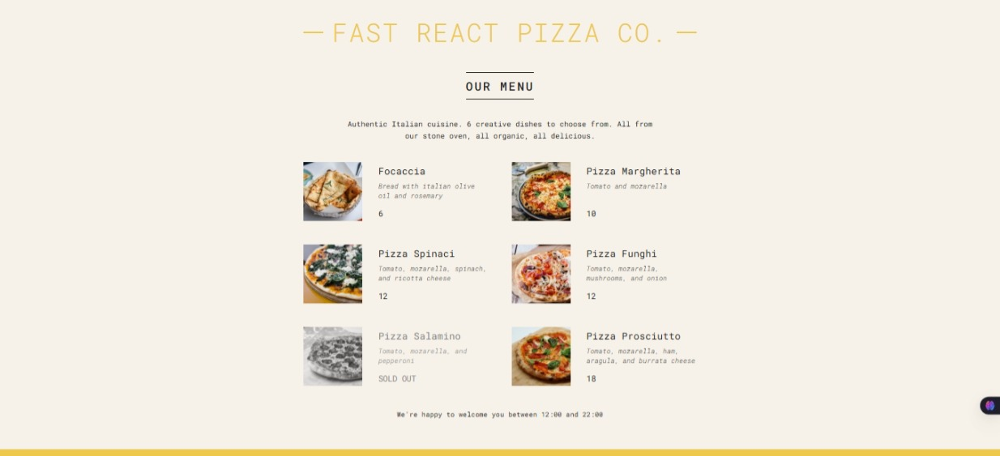

## 🍕 Fast React Pizza Co.

A fun React-based pizza menu app demonstrating the fundamentals of React components, props, conditional rendering, and more. Built for learning and delicious display 😋.

---

### 📸 Preview

  
*A beautiful pizza menu, dynamically rendered using React components.*

---

### 📦 Features

- ✅ Displays a list of pizzas from local data
- 🧾 Conditional rendering for sold-out pizzas
- 🕒 Smart Footer based on business hours
- 🧠 Modular design with reusable components
- 💅 Clean UI using CSS styling

---

### 🛠️ Components Structure

| Component     | Description                                                                 |
| ------------- | --------------------------------------------------------------------------- |
| `App`         | Main container, renders Header, Menu, and Footer                            |
| `Header`      | App header with the restaurant name                                         |
| `Menu`        | Shows available pizzas, or message if no pizzas are available               |
| `Pizza`       | Reusable pizza item component that handles sold-out state                   |
| `Footer`      | Determines if the store is open based on time, shows `Order` if open        |
| `Order`       | Shown when store is open, allows users to “order”                           |

---

### 📂 Project Structure

```cp
.
├── public/
│   └── pizzas/
│       ├── focaccia.jpg
│       ├── margherita.jpg
│       └── ...
├── src/
│   ├── index.js         // Entry point
│   ├── index.css        // Styles
│   └── App (components within index.js)
└── README.md
```
